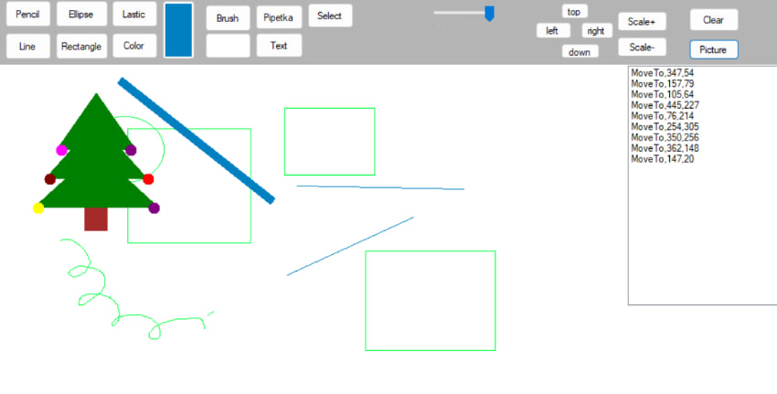
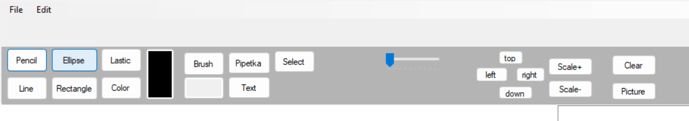

Simple Paint Application is a Windows Forms drawing program developed in C#.
The application allows users to draw basic shapes, freehand lines, edit images, select areas, and save both raster and vector graphics.

This project demonstrates working with:
-Graphics and Bitmap
-Mouse events handling
-Object-oriented programming
-XML serialization
-Image processing in Windows Forms

Features
Drawing Tools
-Pencil (freehand drawing)
-Eraser
-Line
-Rectangle
-Ellipse
-Text tool
-Custom picture drawing (tree example)

Color & Style
-Color picker dialog
-Eyedropper tool (pick color from canvas)
-Adjustable line thickness (TrackBar)
-Brush and pen color customization

Image Operations
-Open image (JPG, PNG, BMP)
-Save image (JPG, PNG, BMP)
-Clear canvas
-Undo (restore previous state)

Selection & Clipboard
-Select rectangular area
-Copy selected area
-Paste copied image
-Move custom drawing (tree) using arrow buttons

Vector Graphics Support
-Save vector shapes to XML
-Load vector shapes from XML

XML serialization of:
-Shape type
-Color
-Thickness
-Coordinates
-Bounds

